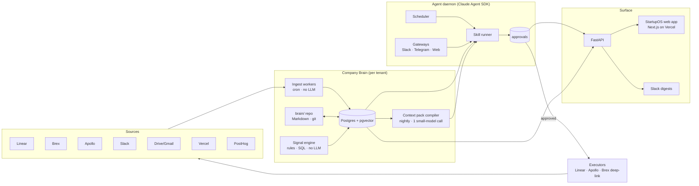

# StartupOS — Architecture Brief

**Companion to `StartupOS_Research_Brief.md`.** That document owns positioning, module scope, pricing and the phased path. This one owns *how it runs*: the independent system outside Cowork, the token economics that make it a business, the use cases each module must deliver, and what a founder experiences on day 0 and on every day after. Written 2026-09-04. Treat it as canonical alongside the research brief; update both when a decision lands.

---

## 0. TL;DR

StartupOS becomes a small, always-on service you own: a **company brain** (Postgres + a git-tracked Markdown corpus) fed by cheap deterministic **ingest workers**, watched by a deterministic **signal engine**, and acted on by a single **agent daemon** built on the Claude Agent SDK that only spends tokens when a signal or a person asks it to. Every action lands in an **approval queue**; nothing executes without a human. The frontend you demoed on Sep 3 becomes a client of this API with its data shapes unchanged.

Hosting on Azure does not burn tokens. Hosting is compute — roughly the cost of one small VM for the first fifty tenants. Tokens are burned by LLM calls, and the design below keeps the LLM out of every loop: no model in ingest, no model in polling, no model in rendering. A founder on the $99 tier should cost **$8–20/month in tokens** at today's list prices, which is the margin that makes SaaS work.

---

## 1. Design principles

1. **Memory is the product.** Every module reads from the brain and writes decisions back. The brain outlives any agent framework — it is a database and a repo, not a chat history.
2. **Tokens are COGS.** Treat every model call like a database write in a hot path: justify it, size it, cache it, batch it. Deterministic first, small model second, frontier model last.
3. **Approve before execute.** The agent proposes; a human disposes. This is the trust contract from the research brief and the only reason it is safe to give the daemon real credentials.
4. **Opens with work already done.** The morning state is computed overnight from data that already arrived. Nothing waits on the user to prompt it.
5. **One daemon, many skills.** Not one agent per module. One runtime with a skill library keyed by module and trigger, so context, memory and budgets are shared.
6. **Sentinel watches it.** A long-running agent holding company credentials is UnitOne's own use case. Ship it instrumented from day one.

---

## 2. System architecture

### 2.1 Components

**Company brain.** Two layers with one truth. `brain/` is a git repo of Markdown, one file per domain (mission, ICP, voice, pricing, team, customers, decisions, finance conventions, GTM state). Humans edit it; the agent writes to it only through approved decisions. Postgres holds the ingested corpus and the structured tables the modules render, with pgvector for retrieval over documents, threads and notes. The Markdown layer is small and always in context; the Postgres layer is large and retrieved on demand.

**Ingest workers.** One Python worker per source, one API key each, on cron. Linear every 15 minutes, Slack channels every 5, Brex hourly, Vercel and PostHog hourly, Drive and Gmail nightly, Apollo via the existing UnitOne GTM scripts. They upsert into typed tables (`issues`, `bills`, `transactions`, `deployments`, `sequences`, `messages`, `documents`) and emit `events`. There is no model anywhere in this path.

**Signal engine.** A rules layer over `events` and the typed tables, written as SQL views and a small Python rule set: "High-priority issue unassigned > 24h", "bill due in 7 days with no scheduled payment", "reply detected in sequence", "deploy failed twice", "customer ask untouched 3 days". Rules produce `signals` with a severity and a suggested skill. Still no model. This is 80% of what the demo's signal feeds show, and it costs nothing per tenant.

**Context pack compiler.** Nightly, one small-model call per tenant turns the brain repo plus the day's signals and deltas into a compact **context pack** — roughly 6–10k tokens — that every agent run loads first. This replaces "RAG on every call" with "one compilation per day." The pack is cached with prompt caching so subsequent runs pay the cached rate.

**Agent daemon.** One long-running process built on the Claude Agent SDK. It has a scheduler (morning pulse, evening digest, weekly review, per-module cadences), gateways (a Slack bot, optionally Telegram, and the web app's Ask bar), and a skill library keyed by module and trigger (the nine `gtm-engine` skills from the research brief plus Finance, Build, Customers, Social and Security skills). The daemon runs a skill only when a signal fires, a schedule ticks, or a person asks. It uses MCP as its tool protocol so the same connector definitions serve the daemon and the developer sandbox.

**Approval gate.** A single `approvals` table: `{id, tenant, module, type, target, preview, exec: {server, tool, input}, status, created_by_run, decided_by, decided_at, result}`. The agent inserts; humans decide via Slack buttons or the web app; **executors** carry out approved rows against Linear, Apollo, Slack, or by deep-linking into Brex (StartupOS never moves money). This table is the exact shape of the `EXEC` map in the Sep 3 artifact.

**API and frontend.** FastAPI over Postgres, JSON shapes matching `MODULE_SNAPSHOTS` and `BREX_SNAPSHOT` from the artifact so the existing UI moves over with renderers intact. Next.js on Vercel for the web app. Slack is the second surface and, for many founders, the first.

### 2.2 Data model (core tables)

| Table | Purpose | Written by |
|---|---|---|
| `tenants`, `users`, `connections` | Tenancy, auth, per-source OAuth/API credentials (Key Vault references, never plaintext) | Onboarding |
| `brain_docs` | Mirror of `brain/` Markdown with version + embedding | Repo sync, approved decisions |
| `issues`, `bills`, `transactions`, `deployments`, `sequences`, `contacts`, `accounts`, `messages`, `documents` | Typed ingested state | Ingest workers |
| `events` | Append-only change log per source | Ingest workers |
| `signals` | Rule hits with severity, module, suggested skill, resolved flag | Signal engine |
| `context_packs` | Nightly compiled pack per tenant, with token count and cache key | Compiler |
| `runs` | Every agent invocation: trigger, skill, tokens in/out, cost, outcome | Daemon |
| `approvals` | Proposed actions and their disposition | Daemon, humans, executors |
| `budgets` | Per-tenant monthly token allowance, spent, degradation state | Billing |

### 2.3 Tenancy and security

Per-tenant Postgres schema (row-level security is fine to start; separate databases at the Team tier). Credentials live in Azure Key Vault and are fetched at run time by executors and ingest workers only — the daemon never sees raw tokens. Every run is logged with tokens and cost. Sentinel instruments the daemon's tool calls for drift and blast radius; that instrumentation is also a product story.

---

## 3. Token economics — how this doesn't burn money

### 3.1 Where tokens actually go

A naive founder-OS burns tokens in four places: polling sources through the model, re-reading the whole knowledge base on every call, rendering dashboards by asking the model to summarize, and letting an agent loop "think" on a schedule whether or not anything changed. The architecture removes all four: ingest and signals are deterministic, the context pack is compiled once a day and cached, dashboards render from Postgres, and the daemon is event-driven.

### 3.2 Three tiers of compute

| Tier | What | Examples | Cost per tenant-day |
|---|---|---|---|
| **0 — deterministic** | SQL, rules, templates | Signal detection, tiles, tables, AP-in-7-days, "reply detected" | $0 |
| **1 — small model** | Classification, extraction, short summaries | Context pack compile, signal triage, message intent, memo extraction from a bill | cents |
| **2 — frontier model** | Drafting, reasoning, multi-step skills | Morning pulse, outreach drafts, campaign plan, release notes, "Ask the OS" | tens of cents to a few dollars |

Rule of thumb: Tier 2 is invoked only by a schedule the user chose, a signal above a severity threshold, or an explicit ask. Everything else stays at Tier 0/1.

### 3.3 Worked budget — one founder, one day

Assumptions to verify against current price sheets: frontier-class roughly $3 per million input and $15 per million output tokens; small-class roughly a third of that; cached input at about a tenth of list.

| Job | Tier | Calls | Tokens in (cached) | Tokens out | Approx. cost |
|---|---|---|---|---|---|
| Context pack compile | 1 | 1 | 40k | 8k | $0.06 |
| Morning pulse | 2 | 1 | 10k (8k cached) | 1k | $0.03 |
| Signal-triggered drafts | 2 | ~6 | 10k each (8k cached) | 600 each | $0.10 |
| Ask the OS | 2 | ~5 | 10k each (8k cached) | 500 each | $0.07 |
| Evening digest | 2 | 1 | 12k (8k cached) | 800 | $0.03 |
| Slack intent triage | 1 | ~30 | 500 each | 50 each | $0.02 |
| **Total** | | | | | **≈ $0.30/day → $9/month** |

A heavy user — a founder running outbound campaigns, drafting content, asking twenty questions a day — lands around $0.60–0.80/day, or $20–25/month. The $99 Founder tier clears that with room; the $299 Team tier shares one brain across seats, so marginal seats are nearly free in tokens.

### 3.4 Guardrails that keep the estimate true

- **Budgets per tenant** in the `budgets` table, with graceful degradation: when 90% is spent, Tier 2 skills switch to "propose only on High signals"; at 100% the OS keeps running on Tier 0/1 and tells the user. Never a surprise bill, never a dead dashboard.
- **Prompt caching** of the context pack and skill instructions on every Tier 2 call.
- **Batching**: signals accumulate and are drafted in one call per module per hour, not one call per signal.
- **BYO key** for power users and design partners — they pay the model provider directly and get a lower platform price. This is the single most efficient configuration and a fair offer to technical founders.
- **Run ledger**: every run records tokens and cost; the Cockpit shows the founder their own spend, which is also the product being honest.

### 3.5 Hosting cost, separately

One Azure VM (4 vCPU, 16 GB) with Docker Compose runs Postgres, the ingest workers, the signal engine, the daemon and the API for the first ~50 tenants: roughly $80–140/month all-in. Vercel Pro for the frontend is already paid. Managed Postgres and a second VM come when tenants pass fifty or when the Team tier needs isolation. Hosting is not the number to worry about; tokens are, and §3.3 shows they are manageable.

---

## 4. Use cases

Each use case names its trigger, the brain inputs it reads, its compute tier, its output, and what the human approves. These are the acceptance criteria for the modules in the research brief's IA.

### Cockpit
- **Morning pulse.** Trigger: schedule (7am local). Reads: context pack, overnight signals. Tier 2. Output: four-line pulse plus "three things that need you." Approve: nothing; it is read.
- **Evening digest to Slack.** Trigger: schedule. Reads: day's runs, approvals decided, signals resolved. Tier 2 (short). Output: what happened, what is waiting. Approve: nothing.
- **Ask the OS.** Trigger: user question. Reads: context pack plus retrieval over `brain_docs` and typed tables. Tier 2. Output: an answer with sources. Approve: nothing.

### Sales / Outbound
- **Reply detected → drafted response.** Trigger: signal from Apollo ingest. Reads: contact, sequence, ICP, voice, pricing. Tier 2. Output: reply draft. Approve: send.
- **Daily enrollment proposal.** Trigger: schedule. Reads: sequence caps, scored targets, exclusions (e.g., Honeywell HOLD). Tier 1. Output: list of N contacts to enroll. Approve: enroll.
- **Campaign wave.** Trigger: user ask or planned date. Reads: targets, /spine evidence, voice. Tier 2. Output: sequence with touches, paused. Approve: activate.
- **Weekly outbound review.** Trigger: schedule (Fri). Reads: sequence stats, attribution merge. Tier 2. Output: what worked, what to change. Approve: proposed changes.

### Finance
- **AP due in 7 days.** Trigger: rule. Reads: bills, vendor terms. Tier 0. Output: queue with deep links into Brex. Approve: user clicks Pay in Brex.
- **Cash and runway.** Trigger: rule on new balances. Tier 0. Output: tiles; alert if runway < threshold. Approve: none.
- **Who paid us.** Trigger: incoming transaction. Reads: invoices, customers. Tier 1 (match payer to invoice). Output: reconciled payments; unmatched flagged. Approve: confirm match.
- **Invoice draft.** Trigger: milestone reached in a POC (from Customers). Reads: pricing, account. Tier 2. Output: invoice draft. Approve: issue.

### Build
- **Stale urgent issue.** Trigger: rule (Urgent/High, no update > N days). Tier 0 detect, Tier 2 draft nudge. Output: Slack nudge draft to owner. Approve: send.
- **Unassigned High → suggested owner.** Trigger: rule. Reads: team AORs, recent assignee history. Tier 1. Output: assignment proposal. Approve: assign (executor calls Linear `save_issue`).
- **Release notes.** Trigger: production deploy with merged PR. Reads: commits, issues closed. Tier 2. Output: notes draft. Approve: publish.
- **Failed deploy log.** Trigger: rule. Tier 0. Output: incident row in brain. Approve: none.

### Customers
- **Customer ask untouched.** Trigger: rule on issues tagged with an account and no movement in 3 days. Tier 0. Output: signal; Tier 2 draft of an internal prioritization proposal. Approve: reprioritize.
- **Account brief before a meeting.** Trigger: calendar (later) or user ask. Reads: account, issues, messages, bills, sequences. Tier 2. Output: one-page brief. Approve: none.
- **Scan result → customer summary.** Trigger: new scan report. Reads: account, findings. Tier 2. Output: email draft. Approve: send.

### Marketing / Web / Social
- **Content asset without a follow-up.** Trigger: rule (asset shipped, no sequence references it in 14 days). Tier 0 detect, Tier 2 draft touch. Approve: enroll.
- **LinkedIn queue batch.** Trigger: engagement signals. Tier 1 to draft short DMs from templates and voice. Output: next five, pre-filled. Approve: user sends each.
- **Post publishing.** Trigger: draft ready in EditorialOS or brain. Tier 0 schedule. Approve: publish.
- **Site analytics off / site stale.** Trigger: rule. Tier 0. Output: signal with one-click fix proposal. Approve: enable / plan.

### IT & Security
- **Duplicate or orphaned security issues.** Trigger: rule (near-duplicate titles). Tier 1 to confirm. Approve: merge.
- **Controls posture.** Trigger: weekly. Reads: Brex roles and cards, repo visibility, secrets policy from brain. Tier 0 tiles, Tier 2 narrative. Approve: none.
- **Findings → issues.** Trigger: scan complete. Tier 1 to structure, Tier 2 to describe. Output: one Linear issue per High/Critical as drafts. Approve: create.

---

## 5. User flows

### 5.1 First run (Day 0) — "opens with work already done" within 15 minutes

1. **Sign up and name the company.** Email or Google. One field: company name and website. Behind it: tenant created, `brain/` initialized from a template, a first Tier 1 call extracts a draft mission, product description, and audience from the public website into `identity.md`.
2. **Connect two sources minimum.** The picker shows Linear, Slack, Brex, Apollo, GitHub, Google Workspace, Stripe. We ask for two and recommend the pair that best matches what the website suggested (a dev tool founder gets Linear + Slack; a services founder gets Brex + Gmail). OAuth or API key; stored in Key Vault. Behind it: ingest workers backfill 90 days per source. This is deterministic and finishes in minutes.
3. **The brain compiles — and shows its work.** A progress screen with real counts ("Read 1,240 Slack messages, 86 issues, 22 bank transactions"). Behind it: one Tier 1 pass extracts candidate memory — ICP, pricing signals, team and AORs, top customers, recent decisions — into five draft cards. Cost: roughly 150–300k tokens once, a few dollars, budgeted as a one-time onboarding cost.
4. **Confirm the five memory cards.** Identity, ICP, Voice, Pricing, Team. Each card shows the extracted draft with the source it came from ("from your pricing page", "from #sales, Aug 12"). The founder edits or accepts. This is the moment the product earns trust: it read the company correctly, or it shows exactly where it was wrong.
5. **First pulse, first approval.** The signal engine has already run over the backfill. The Cockpit opens with real tiles, a real morning pulse, and one or two approvals drawn from real state ("UNI-158 is High and unassigned — assign to Alexey?"). The founder approves one thing and watches it land in Linear. Session ends. Total: under 15 minutes, one Tier 2 call for the pulse, one for the first draft.
6. **Set the cadence.** Last screen: when do you want the pulse (default 7am), where (web, Slack, both), and a monthly token budget with the tier default pre-filled. Slack bot installed here if Slack was connected.

What we deliberately do not do on day 0: ask for a mission statement, show empty modules, or run any Tier 2 job the user did not see the reason for.

### 5.2 Every day

- **7:00 — Pulse arrives** in Slack and the Cockpit: four lines, three things that need you, N approvals waiting. Computed overnight; opening it costs nothing.
- **Approve queue** is the working surface. Each row is a draft with its evidence; Approve executes through the gate, Edit adjusts the draft, Decline records why (the reason feeds the brain as a preference). Ten to thirty seconds per item.
- **Ask the OS** whenever a question comes up: "what did we tell JCI about multi-repo?", "who paid us in June?", "draft the reply to Siemens." Answers cite brain docs and rows.
- **Signals during the day** post to Slack only above a severity threshold — a reply from a prospect, a failed deploy, a bill that moved. Everything else waits for the digest.
- **18:00 — Digest**: what the OS did, what you decided, what is still waiting. One short Tier 2 call.
- **Friday — Weekly review** for Sales and Build, with proposed changes as approvals.

### 5.3 Week two and after

The brain gets richer from decisions, not from prompts: every approve/decline with a reason, every edited draft, every confirmed match writes back. Founders should notice that drafts need fewer edits by week three. That curve is the retention metric.

---

## 6. SaaS shape

- **Tiers map to token budgets and sources.** Founder ($99): 1 seat, 4 sources, ~1.5M Tier 2 tokens/month, Slack + web. Team ($299): 5 seats, unlimited sources, shared brain, ~5M tokens, roles on approvals. Growth ($999): dedicated schema, SSO, audit log, priority connectors, ~20M tokens. Flat, no credits, no revenue share — unchanged from the research brief; budgets are the internal control, not the pricing unit.
- **BYO key** at every tier, minus $30–50/month, for founders who prefer to pay the model provider directly.
- **Overage is degradation, not billing.** When a budget is exhausted, the OS keeps running on Tier 0/1 and offers a top-up. No surprise invoices.
- **Trust contract stays visible.** Every tier page repeats it: StartupOS never moves money, never sends without approval, never holds a credential the executor does not need.
- **Multi-tenant on one VM until 50 tenants**, then managed Postgres and a second daemon host. The daemon is stateless between runs by design — the brain is the state — so scaling it is horizontal.

---

## 7. Build plan

**Week 1 — the brain exists.** VM with Docker Compose; Postgres + pgvector; `brain/` repo seeded from the research brief and today's memory; ingest for Linear, Brex, Slack; signal engine with ten rules; nightly context pack; evening digest to Slack. Outcome: a working company brain for UnitOne with zero agent risk.

**Week 2 — the agent proposes.** Agent daemon on the Claude Agent SDK with scheduler and Slack gateway; morning pulse; Build and Finance skills; approval queue; Linear executor. The Sep 3 artifact rewired to the API. Outcome: the demo, but real and independent.

**Week 3 — Sales joins.** Apollo ingest via the Azure GTM scripts; reply-detected and enrollment skills; weekly review; budgets and the run ledger in the Cockpit. Outcome: UnitOne runs its own GTM through StartupOS.

**Week 4 — onboarding.** Sign-up, source picker, brain compile with the five cards, first-pulse flow, Slack install. Outcome: a second tenant can be created without a human, which is the SaaS test.

**Deferred on purpose:** Stripe and Commerce, Gmail ingest, Telegram gateway, Hermes-style skill learning, SOC2 pipeline. Each is a week, none is on the critical path to a second tenant.

---

**2026-09-04 — Sprint 1 shipped (independent runtime v0.1).** Codebase at `StartupAgents/startupos/` (local git). Brain (10 seed docs, FTS retrieval, context pack), deterministic ingest (Linear/Slack/Brex/Vercel) + 12 signal rules + digest, agent daemon (tiered LLM gateway with prompt caching, budgets, run ledger; approvals; Linear/Slack executors; 7 skills; scheduler; Slack gateway), FastAPI + Next.js onboarding/cockpit. All gates green (151 unit / 8 functional / 4 regression). Process: `startupos-sdlc` skill — read both briefs, task list, parallel agents, lint/unit/functional/regression gates, PE review. Next: keys in `.env`, first live run, Azure compose deploy, Apollo ingest (Week 3).

**2026-09-04 — Sprint 2 shipped: tenant isolation, login, Chief of Staff.** Row Level Security on every tenant table with an RLS-bound DB role; Google OIDC + signed-cookie sessions + hashed API tokens + one-time bootstrap owner; one company-wide role for now (roles inside a company deliberately not separated yet); tenant always derived from the signed-in user. New hub agent `cockpit.chief_of_staff`: sits above the spokes (Sales, Marketing, Customers, Finance, Build, Web, Social, Security), reads the whole brain plus Tier-0 lookahead facts, and raises dated "will happen" vs pattern "might happen" risks per spoke before they land — daily 06:30, on demand via Slack ("what should I worry about") or `/asks`. First real run cost $0.05 and surfaced five risks with issue ids. Gates green (200 unit / 30 functional / 7 regression). Deploy needs the new env vars (session secret, bootstrap token, app-role password) before the API will start.

## 8. Decision queue

- **Runtime:** Claude Agent SDK daemon (recommended) vs. Hermes Agent as the daemon. Recommendation stands on owning the loop and the memory format; Hermes remains a fine read-only prototype on the same brain if a phone gateway is wanted this week.
- **Budget defaults per tier** — confirm the token allowances in §6 against actual usage from week 3.
- **Where `brain/` lives** — a private GitHub repo per tenant (simple, auditable) vs. Postgres-only with export. Recommendation: repo, because founders will want to read and edit it directly.
- **Slack-first or web-first** onboarding for design partners.
- **Sentinel instrumentation** — ship in week 2 as a dogfood, decide in week 4 whether it becomes a visible feature.

---

## Entry for the Research Brief decision log

**2026-09-04 — Independent runtime decided.** StartupOS moves off the Cowork artifact runtime to a self-hosted service: company brain (Postgres + pgvector + `brain/` Markdown repo), deterministic ingest and signal engine, one Claude Agent SDK daemon, approval gate, FastAPI + Next.js. Token strategy: no model in ingest/polling/rendering; nightly compiled context pack with prompt caching; three compute tiers; per-tenant budgets with degradation instead of overage billing; BYO-key option. Target token COGS $8–20/month per Founder seat. Full detail in `StartupOS_Architecture_Brief.md`.

**2026-09-12 — Sprint 3a shipped: multi-tenant runtime (the SaaS test).** A second company can now sign up through the API, paste its own Linear key, and receive a real morning pulse with no operator involvement — the acceptance the 2026-09-12 audit said was failing. Per-tenant credentials are envelope-encrypted (`tenant_secrets`, AES-GCM, `STARTUPOS_MASTER_KEY`); the daemon schedules every job per tenant and discovers new tenants every 5 minutes; ingest iterates tenants × their connections; onboarding "compile" enqueues an ordered chain (backfill → signals → context pack → Chief of Staff → pulse) serviced by the daemon with retries, and the wizard shows the chain's progress. PE review found and fixed two pre-existing cross-tenant defects that Sprint 3a would have made exploitable: any tenant could point a connection at the operator's `env:` keys, and executors ran every tenant's approved Linear/Slack actions with the operator's credentials. Gates green (240 unit / 54 functional / 7 regression). One new required env var: `STARTUPOS_MASTER_KEY`. Remaining for the SaaS story: Slack is still one workspace per install (Sprint 3b), Sales wedge (3c).

**2026-09-13 — Sprint 3b shipped: StartupOS lives in Slack.** The founder no longer has to open the web app. Each tenant installs StartupOS into its own Slack workspace over OAuth (one distributed Slack app, per-tenant bot tokens encrypted in `tenant_secrets` — never env vars); the morning pulse, the evening digest and high-severity signals (plus every Chief of Staff risk) post to the channel that tenant chose, deduped by a `deliveries` ledger; and approvals arrive as Block Kit messages with Approve/Decline buttons that execute through the existing approval gate with that tenant's own credentials and then edit the message in place, so a button cannot be pressed twice. Inbound Slack (events, DMs, button presses) is signature-verified with a 300-second replay window, resolves its tenant from `team_id` alone, acknowledges inside Slack's 3-second budget by queueing to `tenant_jobs`, and is answered by the daemon. Uninstall revokes the install, deletes the token and disables the connection. Gates: 365 unit / 118 functional / 10 regression, including an offline end-to-end regression that walks install → signal → post → button → execute → DM → uninstall for two tenants in two workspaces and proves neither can see or act on the other. Three new install-level env vars (`STARTUPOS_SLACK_CLIENT_ID/SECRET/SIGNING_SECRET`); with them unset — today's production state — every Slack route answers 503 and nothing else changes. Setup runbook: `docs/SLACK-SETUP.md`. **Blocker for going live: Slack must reach the API over HTTPS, and the VM today serves plain HTTP on a port closed in the NSG.** Remaining: Sales wedge (Sprint 3c).

**2026-09-15 — Sprint 3d shipped: one URL to share.** StartupOS becomes something a founder can hand to another person. The Next.js app is deployed for the first time (it was never in the compose file), Caddy sits in front with an automatically issued certificate, and the whole product lives on one hostname — `https://<domain>/` for the app, `https://<domain>/api/…` for the API — so sessions are same-site and there is one certificate, no CORS. Sign-in is Google end to end, and a verified Google identity nobody has seen before is offered a company of its own rather than the old "ask your owner to invite you" dead end; joining an existing company stays invite-only. The VM's public surface becomes 22, 80 and 443 — the API and Postgres move to loopback. Going public changed the threat model, and the PE review fixed five real defects before launch: an unthrottled second door for guessing the bootstrap token, a rate limiter that behind a proxy throttled everyone into one global bucket, one Google account able to mint unlimited tenants (and therefore unlimited model spend), an open redirect on the sign-in page, and a flaky auth test. Self-serve tenants now get a deliberately small model budget (`STARTUPOS_SIGNUP_TIER2_TOKENS`, default 100k versus 1.5M for operator-created), sign-up has an operator off switch, and the API docs no longer serve on a public deployment. Gates: 421 unit / 132 functional / 10 regression, web build/typecheck/lint clean. Runbooks: `docs/HOSTING.md`, `docs/GOOGLE-SIGNIN.md`. PE verdict: safe to expose publicly once the domain, the Google OAuth client and the production `.env` are in place.
